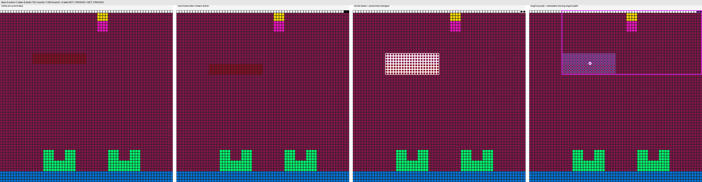
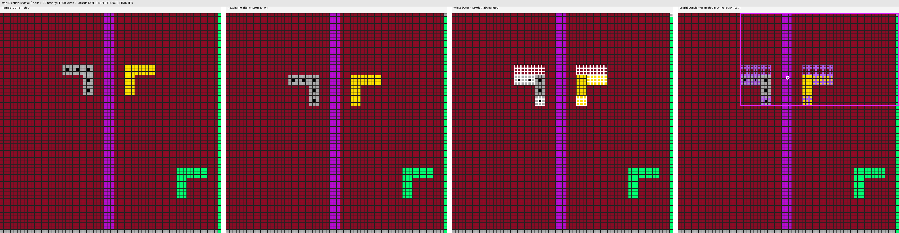

# ARC Prize 2026 — ARC-AGI-3

A small, self-contained pipeline for ARC-AGI-3: probe-first structured
search that produces useful trajectories on the public games, plus a
compact object-centric policy trained from those trajectories.

This README is the project overview — what the system does and why it is
built the way it is. For installing the venv, running the pipeline, and
inspecting outputs, see **[README_SETUP.md](README_SETUP.md)**.

---

## What the system does

The pipeline is a chain of stages that each leave a plain file behind:

```
collect_probe ──► eval_probe ──► probe_triage ──► harvest pass ──► train
   (probe-first    (per-episode    (per-game        (warm-start         (one
   trajectories)    metrics)        labels +         on promising        shared
                                    priors)          games)              checkpoint)
```

The trained model predicts the next action, the click position for
`ACTION6`, a value estimate, and a small transition target for the next
latent state. At inference time the agent uses this policy together with
short-term memory of action effects, progress, and previously-tried
coordinates.

---

## Method

A few intentional choices the pipeline depends on:

**Probe before exploit.** The first ~16 steps of every episode are spent
deliberately testing every non-coordinate action and sampling a diverse
set of click candidates. The exploit policy is then derived from what
those probes observed — action priorities, dead-action pruning, and click
region scoring all read from probe memory. Probing pays for itself the
first time it identifies a no-effect action and saves dozens of useless
steps.

**Effect signatures are the unit of meaning.** Every transition is
classified into one of `no_change`, `small_change`, `motion_like`,
`local_toggle`, `global_change`, `progress`, `game_over`, `win`. The agent
reasons about *what an action did to the world* rather than only whether
the score changed. The classifier is cheap (frame delta + connected
components), stateless, and replaceable by a learned one without touching
the rest of the pipeline.

**Color is observation, not instruction.** Color histograms, dominant-color
summaries, and change-shape labels (motion-like, localized replacement,
broad multi-color) are exposed as features. There are no per-game
"color X means Y" rules anywhere in the code; color affordances are
learned from observed outcomes and carried forward in the per-game priors.

**Memory persists across env resets within an episode.** Probe memory is
not cleared by `env.reset()` inside the same `play_env` call. Resetting
the world does not reset what the agent learned about which actions were
inert.

**Anti-loop logic is observable.** Repeat penalties, 2-cycle and 3-cycle
detection, the stagnation escape with cooldown, the local follow-up
window, and the global-change-triggered reprobe budget all emit counters
into `loop_metrics.totals` so a regression shows up in the eval JSON
instead of in the GIF.

**Per-game priors are append-only state.** Dead actions, dead coords,
promising clicks, color affordances, and stage stats are written to
`priors/<game_id>.json` and carried forward across stages and across
runs. Later stages warm-start from them; later runs (e.g. the harvest
pass) seed themselves by copying the prior folder.

**Triage is observation-driven.** Game labels come from counts on the
collected episodes — not from a static list of "good games" and not from
a game-ID lookup. A game can carry several labels at once; harvest reads
those labels to decide what to revisit.

**One file format end-to-end.** Every collector writes the same
`episodes.jsonl.gz` shape with extra annotation fields. Eval, triage,
training, and inspection all read this same file — there is no separate
intermediate representation to maintain.

---

## Focus-5 and the example trajectories

Method validation runs on a five-game subset:

- `sp80`, `lp85`, `ar25` — positive core (level-1 reachable; useful for
  measuring real progress)
- `ls20`, `r11l` — control games that surface stalling and death loops

The full 25-game broad pass and the harvest pass widen the scope after
focus-5 confirms the pipeline is producing meaningful trajectories.

**`sp80` reaches level 1, then `GAME_OVER`**



**`lp85` reaches level 1, then `NOT_FINISHED`**


**`ar25` reaches level 1, then `NOT_FINISHED`**



These episodes are what "real progress" looks like in the eval JSON: a
non-zero `levels_after`, a `progress` signature on at least one
transition, and a `memory_summary` that tags the action that produced it.
Empty motion loops show up as the opposite — high `repeat_action_count`,
all-`no_change` action stats, and a stagnation escape that fires.

---

## Hardware

The default starting profile is Colab `A100`, `bf16`. The public
environment count is small, so search quality and generalization matter
more than very large model scale; the model size and training loop fit
on A100 without wasting capacity. H100 works but is not required.

| Profile          | `model_dim` | `depth` | `num_slots` | `batch_size` | `epochs` | `grad_accum` |
|---               |---:|---:|---:|---:|---:|---:|
| A100 (recommended) | 384 | 6 | 8 | 192 | 16 | 1 |
| RTX 3070 Ti 8 GB   | 256 | 4 | — | 16  | —  | 8 |

The probe-first collector and the evaluator run fine on a laptop CPU.
Local timing on a developer machine: focus-5 single-pass is ~100 s, the
25-game broad pass is ~6.5 min, the harvest pass is ~6.6 min. Only
training meaningfully benefits from GPU.

---

## Competition notes

Implementation follows the public rules checked on April 22, 2026.

- Kaggle submissions are generated automatically after the notebook
  interacts with the competition environments.
- The competition notebook runs in `Competition Mode`: one scorecard per
  run, each environment can only be created once, scorecard closed at
  the end.
- Local validation uses the current public scoring cap of `115%` per
  level.

---

## Where to go next

- **Install + run the pipeline →** [README_SETUP.md](README_SETUP.md)
- **Train on your own collected data →** [README_SETUP.md, "Training"](README_SETUP.md#5-training)
- **Colab path →** `ColabNotebook/train_arc_agi3_colab.ipynb`

---

## References

Official competition and toolkit:

- [Kaggle Competition Overview](https://www.kaggle.com/competitions/arc-prize-2026-arc-agi-3/overview)
- [Kaggle Competition Data](https://www.kaggle.com/competitions/arc-prize-2026-arc-agi-3/data)
- [ARC AGI 3 Scoring Methodology](https://docs.arcprize.org/methodology)
- [ARC AGI Toolkit](https://github.com/arcprize/arc-agi)
- [ARC AGI 3 Agents](https://github.com/arcprize/ARC-AGI-3-Agents)

Method references that informed the design:

- [Decision Transformer](https://arxiv.org/abs/2106.01345)
- [DreamerV3](https://arxiv.org/abs/2301.04104)
- [Plan2Explore](https://arxiv.org/abs/2005.05960)
- [Slot Attention](https://arxiv.org/abs/2006.15055)
- [DITTO](https://openreview.net/forum?id=Ix4Ytiwor4U)
- [Transformers meet Neural Algorithmic Reasoners](https://arxiv.org/abs/2406.09308)
- [ARC Prize HRM analysis](https://arcprize.org/blog/hrm-analysis)
