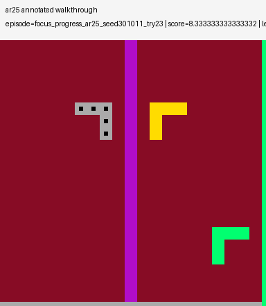
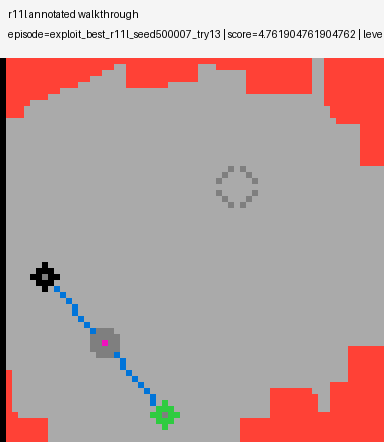
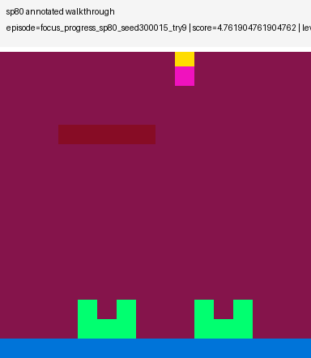
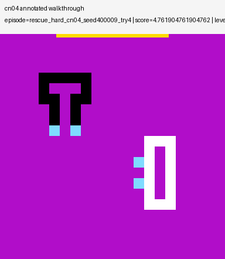
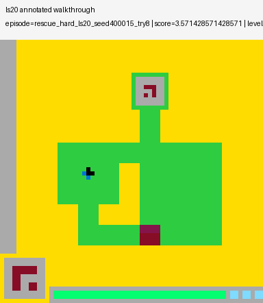
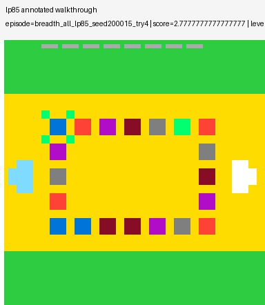

# ARC Prize 2026 ARC AGI 3

## Yiding 05.03.2026 Progress & Recommendation for Next Step

### Current Main Pipeline

The current end to end workflow is:

1. `src.collect.py` runs search based ARC exploration and writes collected episodes to `episodes.jsonl.gz`.
2. `src.collect_staged.py` wraps the same collector in a staged curriculum search. This is the path that produced my current best OpenLab collect cache.
3. `src.train.py` trains a policy model from one or more collected `.gz` files.
4. `src.evaluate.py` runs rollout evaluation on a chosen game split or game list.

I use `.gz` because the code stores one episode per JSON line and appends or streams it through `append_jsonl_gz()` and `iter_jsonl_gz()`. In practice this gives me three advantages: the files stay much smaller than plain JSON, they are easier to transfer between OpenLab and Google Drive, and the training code can iterate through them without loading every episode into memory at once.

### What I Have Actually Achieved

The earliest full 25 game OpenLab collect was weak: one long run saved `1057` episodes before timing out, only `64` episodes had nonzero score, all `64` came from `lp85`, there were `0` wins, and the maximum level reached was only `1`.

After I added stronger loop penalties, stronger penalties for no effect coordinate clicks, short probe rollouts, and earlier stopping after progress collapse, the best staged OpenLab collect became much better. The strongest run is:

`openlab_collect_best_v3_20260425`

That run produced:

- `596` total episodes across all `25` public games
- `202` positive episodes with both nonzero score and level progress
- `6` games with any positive best result
- `394` level 0 episodes, `192` level 1 episodes, and `10` level 2 episodes
- `ar25` as the only game that reached level `2`

### Top 6 Best Result Games' Annotated GIFs

To make the GitHub README render correctly, I copied the annotated GIFs into `docs/gifs/openlab_collect_best_v3/`.

ar25: best level 2, score 8.333, 128 actions



r11l: best level 1, score 4.762, 55 actions



sp80: best level 1, score 4.762, 63 actions



cn04: best level 1, score 4.762, 123 actions



ls20: best level 1, score 3.571, 87 actions



lp85: best level 1, score 2.778, 112 actions



### What Did Not Work

Training a single checkpoint on the full `25` game human replay dataset did not translate into good rollout behavior. In one seen game evaluation over the `20` training games, only `sp80` produced any positive score. The final aggregate result was:

- `mean_score = 0.238095`
- `mean_levels_completed = 0.05`

To test whether this was mostly caused by cross game interference, I also trained a single game `ar25` checkpoint locally on my Mac M3 using only filtered `ar25` human episodes.

The downloadable result artifacts that I mirrored into the repo for teammates are:

- [single-game `ar25` metrics.csv](docs/results/single_game_ar25/metrics.csv)
- [single-game `ar25` train_config.json](docs/results/single_game_ar25/train_config.json)
- [single-game `ar25` best rollout eval JSON](docs/results/single_game_ar25/ar25_best_public_eval.json)
- [single-game `ar25` last rollout eval JSON](docs/results/single_game_ar25/ar25_last_public_eval.json)
- [single-game `ar25` best checkpoint `.pth`](docs/results/single_game_ar25/ar25_best_checkpoint.pth)

However, both final rollout evaluations were still poor:

- `ar25_best_public_eval.json`: `score 0.0`, `levels_completed 0`, `actions_taken 120`, `NOT_FINISHED`
- `ar25_last_public_eval.json`: `score 0.0`, `levels_completed 0`, `actions_taken 120`, `NOT_FINISHED`

This means the current best practical behavior is still coming from direct search based collection, not from the learned checkpoint.

### My Suggestion For Our Next Step

The most practical next step is a team based focused collect plan. Each team member can take five games, while the remaining five stay untouched as a held out test set. The immediate goal should not be “train one general policy first.” The immediate goal should be to improve trajectory quality on owned games by directly making the collector stronger.

Concretely, this is feasible if I use `collect.py` and especially `collect_staged.py` as the main research loop and improve:

- loop prevention
- useless click rejection
- deeper search after the first level transition
- better local exploration when a game starts to make real progress

After each teammate pushes their five owned games from level 0 to higher levels such as level 4 or level 5 and exports better `episodes.jsonl.gz` files, I can merge those `.gz` files and retrain on a much stronger supervision set.

This plan can produce progress, but with one important caveat: it is a good plan for collecting stronger behavior data, not a guarantee of cross game generalization by itself. To keep the evaluation honest, the held out five game test set should stay untouched by game specific collector tuning.

## Yiding 04262026.0125 Progress Update

I first ran a full OpenLab collect across all 25 public games, but the overall trajectory quality was weak. One long run saved 1057 episodes before timing out, but only 64 episodes had nonzero score, all 64 came from `lp85`, there were 0 wins, and the maximum level reached was only 1. This told me that the main problem was not the training loop yet, but the fact that collect was still producing too many low value trajectories.

I then inspected the runs with GIFs and found a repeated pattern of meaningless exploration. In several games, the agent kept repeating short action templates, reused `ACTION6` with little effect, or reached level 1 and then stalled instead of continuing productively. I responded by adding stronger loop penalties, stronger penalties for no effect coordinate clicks, short rollout based probing, and earlier stopping when a run collapses after making progress. These changes improved a few cases, but most games still get stuck at level 0, so the current method is not solved yet.

The latest OpenLab run produced a few better level 1 examples in `sp80`, `lp85`, and `ar25`. I am keeping these examples visible because they help me compare “real progress” against empty motion loops and understand where the agent still gets stuck after entering the next level.

### Example GIFs

**`sp80` level 1, then `GAME_OVER`**


**`lp85` level 1, then `NOT_FINISHED`**


**`ar25` level 1, then `NOT_FINISHED`**


## My Suggestion

I should stop treating all 25 games as equally important during early method validation. Instead, I should focus on a small five game set: `sp80`, `lp85`, and `ar25` as the positive core, plus `ls20` and `r11l` as control games that expose stalling and death loops. This should let me verify whether the collect and train loop is genuinely learning, or only memorizing a few lucky cases.

A team based workflow is practical here. Each teammate can focus on a small subset of games, tune collect on a separate branch, and export a higher quality `episodes.jsonl.gz`. I can then merge those files during training and learn one shared checkpoint from all of them together. The training code now supports multiple input trajectory files through a comma separated `--data` argument, so I can combine experience from several focused `.gz` files into one `.pth` checkpoint.

Example:

```bash
python -m src.train \
  --project-root "." \
  --data './path/to/member_a.gz,./path/to/member_b.gz,./path/to/member_c.gz' \
  --output-dir './Local_Output/Training/team_focus_train_v1'
```

This repo contains a minimal end to end pipeline for ARC AGI 3.

The current method uses structured search on 25 public games to collect useful trajectories, then trains a compact object centric policy model from those trajectories. The model predicts the next action, the click position for `ACTION6`, a value estimate & a small transition target for the next latent state. At inference time, the agent uses the trained policy together with short term memory about action effects, progress, and previously tried coordinates.

The repo is intentionally small. The only maintained project code lives in `src/` and `ColabNotebook/`. The bundled `ARC-AGI-3-Agents/` folder & `arc_agi_3_wheels/` folder are kept as official reference assets from the dataset package.

## Files

- `src/collect.py` collects public game trajectories with structured search
- `src/train.py` trains the policy model
- `src/evaluate.py` runs public game evaluation
- `src/competition.py` runs the agent in competition mode
- `ColabNotebook/train_arc_agi3_colab.ipynb` is the Colab training entry point

## Competition Notes

The current implementation follows the public rules checked on April 22, 2026.

- Kaggle submissions are generated automatically after the notebook interacts with the competition environments
- The competition notebook runs in `Competition Mode`
- In `Competition Mode`, the run uses one scorecard and each environment can only be created once
- The scorecard is closed at the end of the run

The local validation code uses the current public scoring cap of `115%` per level.

## Hardware Recommendation

The default recommendation for the first training runs is Colab `A100`.

- The public environment count is small, so search quality and generalization matter more than very large model scale
- The current model size and training loop fit well on A100 without wasting too much capacity
- H100 can be used, but it is not required for the first version

Suggested starting profile:

- GPU: `A100`
- Precision: `bf16`
- `model_dim=384`
- `depth=6`
- `num_slots=8`
- `batch_size=192`
- `epochs=16`

Fallback profile for `RTX 3070 Ti 8GB`:

- `model_dim=256`
- `depth=4`
- `batch_size=16`
- `grad_accum=8`

## Training Output

The Colab notebook copies project code from the synced project folder in Google Drive.

The Colab notebook writes outputs to the configured Drive output root, typically:

`Training_Output/<timestamp>/`

Cached public trajectory collection can be stored separately under:

`Collection_Cache/<collect_tag>/`

For a local precompute run on a Mac M3 CPU, a lighter profile is available:

- hardware profile: `m3_cpu`
- intended use: run `collect` locally once, then reuse the cached `episodes.jsonl.gz` for multiple Colab training runs

The output folder includes:

- `metrics.csv`
- `checkpoints/best.pth`
- `checkpoints/last.pth`
- `checkpoints/interrupt.pth` when training is stopped manually
- `summary.json`

The cached collection folder includes:

- `collected/episodes.jsonl.gz`

## Local Collect on Mac M3

You can precompute the public search trajectories on a local Mac M3 CPU, then upload the resulting folder to Google Drive and reuse it in Colab.

On macOS, install dependencies from PyPI in a local virtual environment. The bundled wheel folder includes several Linux-only dependency wheels and should not be used as the main install source on Mac.

Recommended first pass command:

```bash
cd <repo-root>
python -m src.collect \
  --project-root "." \
  --output-root "./Local_Output/Collection_Cache/public_search_m3_v1" \
  --hardware-profile m3_cpu \
  --seeds 0,1 \
  --max-steps 64
```

This creates:

`./Local_Output/Collection_Cache/public_search_m3_v1/collected/episodes.jsonl.gz`

After the local run finishes, upload the `public_search_m3_v1` folder to your shared Google Drive collection cache folder.

Then set:

- `RUN_COLLECTION = False`
- `COLLECT_TAG = 'public_search_m3_v1'`

in the Colab notebook so training reuses the cached trajectories instead of recollecting them.

## Openlab Collect

For longer CPU-heavy collection runs on UCI ICS Openlab, use Slurm instead of keeping a long interactive shell job. Openlab documentation notes that long-running non-Slurm processes may be reniced or suspended, while Slurm jobs are exempt.

Copy the project to Openlab:

```bash
rsync -av --delete --exclude '.git' \
  <repo-root>/ \
  <openlab-user>@openlab.ics.uci.edu:<openlab-project-root>/
```

On Openlab, create a virtual environment and install from the bundled Linux wheels:

```bash
cd <openlab-project-root>
python3 -m venv .venv
source .venv/bin/activate
python -m pip install -U pip wheel setuptools
python -m pip install arc_agi_3_wheels/*.whl
```

Single-node parallel collect on Openlab:

```bash
cd <openlab-project-root>
source .venv/bin/activate
python -m src.collect \
  --project-root "." \
  --output-root "./Local_Output/Collection_Cache/openlab_search_v1" \
  --hardware-profile a100 \
  --seeds 0,1,2,3 \
  --max-steps 96 \
  --workers 16
```

The `--workers` flag parallelizes collection across CPU processes on one node. Increase it only as far as the node memory and process limits allow.

## References

Official competition and toolkit references:

- [Kaggle Competition Overview](https://www.kaggle.com/competitions/arc-prize-2026-arc-agi-3/overview)
- [Kaggle Competition Data](https://www.kaggle.com/competitions/arc-prize-2026-arc-agi-3/data)
- [ARC AGI 3 Scoring Methodology](https://docs.arcprize.org/methodology)
- [ARC AGI Toolkit](https://github.com/arcprize/arc-agi)
- [ARC AGI 3 Agents](https://github.com/arcprize/ARC-AGI-3-Agents)

Method references that informed the design:

- [Decision Transformer](https://arxiv.org/abs/2106.01345)
- [DreamerV3](https://arxiv.org/abs/2301.04104)
- [Plan2Explore](https://arxiv.org/abs/2005.05960)
- [Slot Attention](https://arxiv.org/abs/2006.15055)
- [DITTO](https://openreview.net/forum?id=Ix4Ytiwor4U)
- [Transformers meet Neural Algorithmic Reasoners](https://arxiv.org/abs/2406.09308)
- [ARC Prize HRM analysis](https://arcprize.org/blog/hrm-analysis)
