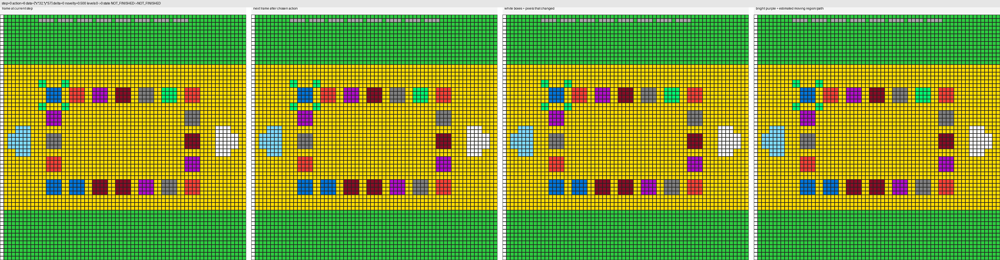

# ARC-AGI-3 Probe-First Agent

A reproducible pipeline for the ARC-AGI-3 competition: probe-first structured
search that produces useful trajectories on the public games, plus a compact
object-centric policy trained from those trajectories.

The goal of this folder is a clean, hand-off-ready deliverable. Code, scripts,
configs, and docs are organized so a new contributor can install, run a smoke
test, and reproduce the full pipeline end to end without referring back to
private notes.

---

## What the system does

```
collect/probe ──► eval/probe ──► eval/triage ──► harvest pass ──► train
   (probe-first    (per-episode    (per-game        (warm-start         (object-
   trajectories)    metrics)        labels +         on promising        centric
                                    priors)          games)              policy)
```

The trained model predicts the next action, the click position for `ACTION6`,
a value estimate, and a small transition target for the next latent state. At
inference time the agent uses this policy together with short-term memory of
action effects, progress, and previously-tried coordinates.

A few intentional choices the pipeline depends on:

- **Probe before exploit.** The first ~16 steps of every episode test every
  non-coordinate action and sample a diverse set of click candidates. The
  exploit policy is then derived from what those probes observed.
- **Effect signatures are the unit of meaning.** Every transition is
  classified into one of `no_change`, `small_change`, `motion_like`,
  `local_toggle`, `global_change`, `progress`, `game_over`, `win`. The agent
  reasons about *what an action did to the world* rather than only the score.
- **Color is observation, not instruction.** Color histograms and
  change-shape labels are exposed as features. There are no per-game
  "color X means Y" rules; affordances are learned from observed outcomes.
- **Per-game priors are append-only state.** Dead actions, dead coords,
  promising clicks, color affordances, and stage stats are written to
  `priors/<game_id>.json` and warm-started by later stages and later runs.
- **Triage is observation-driven.** Game labels come from counts on collected
  episodes — not from a static list of "good games".
- **One file format end-to-end.** Every collector writes `episodes.jsonl.gz`.
  Eval, triage, training, and inspection all read this same file.

For the full design discussion see [docs/PIPELINE_OVERVIEW.md](docs/PIPELINE_OVERVIEW.md).

---

## Folder structure

```
arc_agi3_agent/
├── README.md                  # this file
├── requirements.txt           # Python deps (torch installed separately)
├── .gitignore
├── configs/                   # per-workflow defaults (focus5, broad25, harvest)
├── src/
│   ├── agents/                # ProbeFirstAgent, PolicyGuidedAgent, model
│   ├── collect/               # probe + staged + policy collectors, human-replay import
│   ├── train/                 # training loop
│   ├── eval/                  # probe metrics, policy eval, triage, competition, inspect
│   └── utils/                 # grid primitives, color features, effect signatures
├── scripts/                   # PowerShell entry points for each stage
├── docs/
│   ├── PIPELINE_OVERVIEW.md   # full pipeline walk-through
│   ├── EXPERIMENT_NOTES.md    # internal experiment log (preliminary results)
│   └── gifs/                  # example trajectories shown below
├── environment_files/         # bundled ARC-AGI-3 game environments (25 games)
├── wheels/                    # pure-Python arc_agi + arcengine wheels
├── outputs/                   # all run artifacts land here (gitignored)
└── archive/                   # parking lot for older experiments
```

---

## Setup (Windows / PowerShell)

Use Python 3.12 or 3.13 (64-bit). From the `arc_agi3_agent/` folder:

```powershell
py -3.13 -m venv .venv313
.\.venv313\Scripts\Activate.ps1
python -m pip install -U pip wheel setuptools

# arc_agi + arcengine are bundled as pure-Python wheels:
pip install ".\wheels\arc_agi-0.9.8-py3-none-any.whl"
pip install ".\wheels\arcengine-0.9.3-py3-none-any.whl"

# torch comes from the official PyTorch index (CPU here; use cu121 for GPU):
pip install --index-url https://download.pytorch.org/whl/cpu torch

# everything else from PyPI:
pip install -r requirements.txt
```

Verify the install:

```powershell
python -c "import torch, arc_agi, arcengine; from src.collect import probe; from src.eval import probe as ep; print('OK', torch.__version__)"
```

If activation is blocked by execution policy, run once per user:
```powershell
Set-ExecutionPolicy -Scope CurrentUser -ExecutionPolicy RemoteSigned
```

macOS / Linux setup mirrors the above; substitute `python3.13 -m venv .venv` and
`source .venv/bin/activate`. On Linux you may also bulk-install the bundled
wheels in `wheels/` (additional Linux wheels for numpy/pillow/matplotlib/etc.
live in the parent repo's `arc_agi_3_wheels/` folder if you need an offline
install).

---

## Running the pipeline

All commands assume the venv is active and the working directory is the
`arc_agi3_agent/` root. Outputs land under `outputs/probe_cache/<run_name>/`.

### 1. Probe collection (single-pass, smoke test)

```powershell
.\scripts\run_probe.ps1
```

Runs the probe-first collector on the focus-5 subset (`sp80,lp85,ar25,ls20,r11l`)
plus probe evaluation. Wall-clock ~100s on a laptop CPU.

### 2. Staged collection (focus-5)

```powershell
.\scripts\run_staged_collection.ps1
```

Five-stage pipeline (`probe_seed`, `exploit_safe`, `followup_focus`,
`rescue_reprobe`, `harvest_best`) with per-stage knob overrides and per-game
priors recomputed before each stage. Writes evaluation + triage as well.

### 3. Broad first pass (all 25 games)

```powershell
.\scripts\run_broad_collection.ps1
```

~250 episodes total, ~6.5 min on CPU. Produces the priors and triage that the
harvest pass reads.

### 4. Harvest pass (triaged-promising games)

```powershell
.\scripts\run_harvest.ps1 <broad_run_name>
```

Reuses the priors from a previous broad run and re-collects only games labeled
`promising`, `signal_but_stuck`, `click_promising`, or `movement_promising`,
weighted toward `harvest_best`, `rescue_reprobe`, and `followup_focus`.

### 5. Training

```powershell
.\scripts\train_probe_model.ps1 <run_name>
```

Auto-discovers all `episodes.jsonl.gz` under `outputs\probe_cache\` and trains
the policy. Pass an explicit comma-separated path list as the second argument
to control which collections feed training.

### 6. Checkpoint evaluation

```powershell
.\scripts\evaluate_checkpoint.ps1 outputs\training\<run_name>\checkpoints\best.pth
```

Runs the trained policy on the public games. Set `$env:EVAL_GAMES = "sp80,lp85"`
to restrict the game set.

### 7. Re-run triage on an existing run

```powershell
.\scripts\run_triage.ps1 <run_name>
```

Cheap: reads `episodes.jsonl.gz` and rewrites the `triage/` folder.

---

## Where outputs are saved

```
outputs/
├── probe_cache/<run_name>/
│   ├── collected/episodes.jsonl.gz       one line per episode, gzipped JSON
│   ├── probe_eval.json                   per-game + overall metrics
│   ├── priors/<game_id>.json             per-game persistent state
│   └── triage/
│       ├── triage_summary.json           multi-label per-game classification
│       ├── triage_summary.csv            same, flat CSV for spreadsheets
│       └── per_game_stage_summary.json   rates split by (game, stage)
├── training/<run_name>/
│   ├── metrics.csv
│   ├── checkpoints/{best,last}.pth
│   └── summary.json
└── evaluation/<run_name>.json
```

Everything under `outputs/` is gitignored. Episode caches and checkpoints are
regenerable from the configs and scripts.

### Per-game priors

`priors/<game_id>.json` carries dead actions, dead coords, promising clicks,
color affordances, stage stats, best seed, and the running color accumulator.
Subsequent stages and runs warm-start from this file.

### Triage labels

| Label                  | Condition |
|---                     |---|
| `promising`            | `best_score > 0` or `progress_rate >= 0.2` |
| `signal_but_stuck`     | plenty of `LOCAL_TOGGLE` / `GLOBAL_CHANGE`, no progress |
| `low_signal`           | mostly `NO_CHANGE` / `SMALL_CHANGE` |
| `dead_or_noisy`        | very high dead-action rate, no progress |
| `click_promising`      | `ACTION6` effective rate `>= 0.4` |
| `movement_promising`   | `MOTION_LIKE` share of effective signatures `>= 0.35` |

A game can carry several labels at once. The harvest pass reads
`triage_summary.json` and `--include-labels` to pick which games to revisit.

---

## Example trajectories

Three episodes from the focus-5 subset that reach level 1, illustrating what
"real progress" looks like in `probe_eval.json` (non-zero `levels_after`,
`progress` signature on at least one transition, and a `memory_summary` that
tags the action that produced it):

`sp80` reaches level 1, then `GAME_OVER`:


`lp85` reaches level 1, then `NOT_FINISHED`:


`ar25` reaches level 1, then `NOT_FINISHED`:


These are illustrative cases, not headline metrics. Aggregate numbers live in
[`docs/EXPERIMENT_NOTES.md`](docs/EXPERIMENT_NOTES.md) and are flagged as
preliminary internal experiments.

---

## Hardware

The default starting profile is Colab `A100`, `bf16`. The probe-first collector
and the evaluator run fine on a laptop CPU; only training meaningfully benefits
from GPU.

| Profile             | `model_dim` | `depth` | `num_slots` | `batch_size` | `epochs` | `grad_accum` |
|---                  |---:|---:|---:|---:|---:|---:|
| A100 (recommended)  | 384 | 6 | 8 | 192 | 16 | 1 |
| RTX 3070 Ti 8 GB    | 256 | 4 | — | 16  | —  | 8 |

Local timing on a developer machine: focus-5 single-pass ~100 s, 25-game broad
pass ~6.5 min, harvest pass ~6.6 min.

---

## References

Official competition and toolkit:

- [Kaggle Competition Overview](https://www.kaggle.com/competitions/arc-prize-2026-arc-agi-3/overview)
- [ARC AGI 3 Scoring Methodology](https://docs.arcprize.org/methodology)
- [ARC AGI 3 Agents](https://github.com/arcprize/ARC-AGI-3-Agents)

Method references that informed the design:

- [Decision Transformer](https://arxiv.org/abs/2106.01345)
- [DreamerV3](https://arxiv.org/abs/2301.04104)
- [Plan2Explore](https://arxiv.org/abs/2005.05960)
- [Slot Attention](https://arxiv.org/abs/2006.15055)
- [Transformers meet Neural Algorithmic Reasoners](https://arxiv.org/abs/2406.09308)
